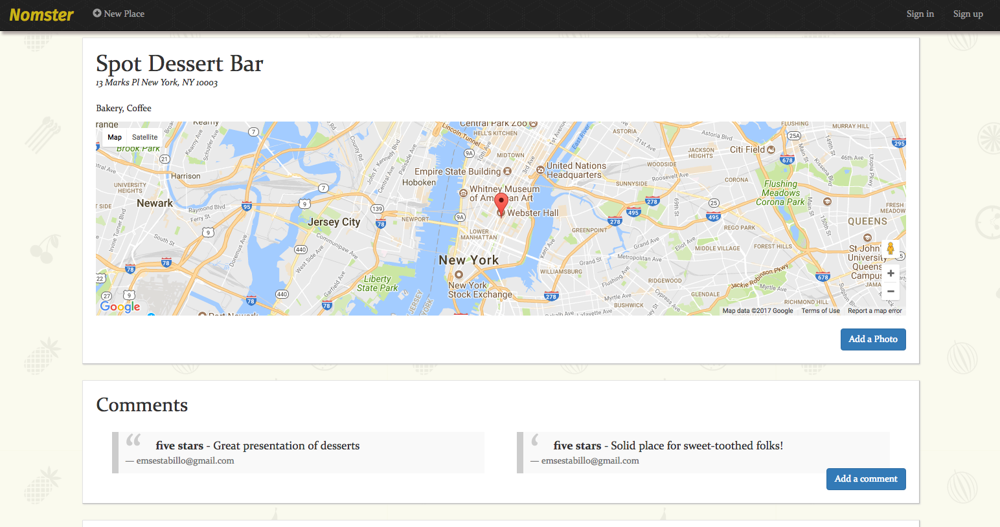

# Nomster

A Yelp clone that integrates with the Google Maps API and includes features like user comments, star ratings, image uploading, and user authentication.



## Installation

Add this to your application's Gemfile:
```
  gem 'geocoder'
```

Create your Google API key and then execute:
```ruby
$ bundle install
```

## Contributing

1. Fork it ( https://github.com/emestabillo/nomster/fork )
2. Create your feature branch (git checkout -b my-new-feature)
3. Commit your changes (git commit -am 'Add some feature')
4. Push to the branch (git push origin my-new-feature)
5. Create a new Pull Request

---

## License and Copyright

Copyright (c) 2017 Em Estabillo